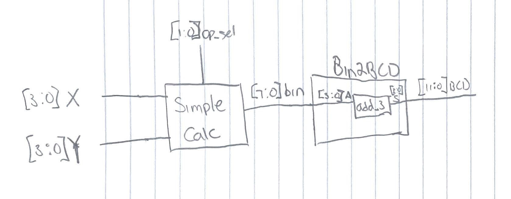

# lab-2---binary-to-bcd-berberian-minas-snyder-chandler
lab-2---binary-to-bcd-berberian-minas-snyder-chandler created by GitHub Classroom

This is the repository for Lab 2 by Minas Berberian and Chandler Snyder. 
We were to design a calculator similar to that in lab 1 but it is now supposed to output the answer in BCD.

Video Demo:  

Diagram of Part 2: 

Screenshot of bin2bcd testbench: 
